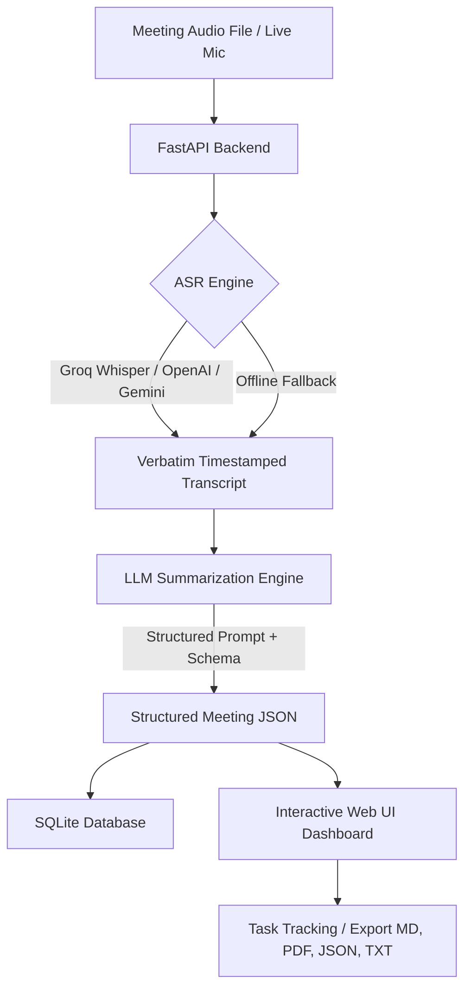

# 🎙️ MeetPulse AI — Intelligent Meeting Summarizer & Action Item Extractor

[](https://meeting-summarizer-aps.vercel.app/)
[](https://meeting-summarizer-0we1.onrender.com)
[](https://www.python.org/)
[](https://fastapi.tiangolo.com/)

> **Automated meeting audio transcription, structured intelligence extraction, key decision logging, and interactive action items tracking.**

---

### 🌐 Live Deployment Links
- 🚀 **Live Web App (Vercel):** **[https://meeting-summarizer-aps.vercel.app/](https://meeting-summarizer-aps.vercel.app/)**
- ⚡ **Live Backend API (Render):** **[https://meeting-summarizer-0we1.onrender.com](https://meeting-summarizer-0we1.onrender.com)**
- 📖 **Interactive API Docs (Swagger UI):** **[https://meeting-summarizer-0we1.onrender.com/docs](https://meeting-summarizer-0we1.onrender.com/docs)**

---

## 📌 Project Overview

**MeetPulse AI** is an end-to-end AI-powered meeting intelligence system designed to transcribe audio recordings and extract action-oriented summaries, explicit decisions made, discussion topics, and assigned tasks with deadlines and priorities.

### Key Capabilities
- 🎧 **Multi-Engine ASR Transcription**: Supports Groq Whisper (`whisper-large-v3`), OpenAI Whisper (`whisper-1`), Google Gemini Audio, and an offline fallback demo mode.
- 🧠 **LLM-Driven Intelligence**: Generates structured executive summaries, categorized discussion points, unambiguous decisions, and task lists.
- 🎙️ **Live Microphone Recording**: In-browser recording with real-time HTML5 canvas audio waveform visualizer.
- 📁 **Universal Audio Ingestion**: Drag-and-drop support for `.mp3`, `.wav`, `.m4a`, `.ogg`, `.webm`, and `.mp4`.
- ✅ **Interactive Action Items Checklist**: Real-time task status toggling (`pending` / `completed`) persisted directly in the database.
- 🔍 **Interactive Transcript Viewer**: Verbatim transcript with in-text keyword search and instant copy.
- 💾 **Persistent Meeting History**: Searchable SQLite database tracking all meetings and completion metrics.
- 📤 **Multi-Format Export**: One-click downloads for **Markdown (`.md`)**, **PDF Reports (`.pdf`)**, **JSON (`.json`)**, and **Plain Text (`.txt`)**.

---

## 🏛️ System Architecture



---

## 📂 Project Structure

```
meeting-summarizer/
│
├── backend/
│   ├── app/
│   │   ├── __init__.py
│   │   ├── main.py              # FastAPI app & static file mounting
│   │   ├── config.py            # Environment configuration
│   │   ├── database.py          # SQLAlchemy SQLite connection & session
│   │   ├── models.py            # Database models (Meeting, ActionItem)
│   │   ├── schemas.py           # Pydantic validation schemas
│   │   ├── services/
│   │   │   ├── asr_service.py   # Speech-to-text (Whisper, Gemini, Groq, Fallback)
│   │   │   ├── llm_service.py   # LLM summarization & structured prompt engineering
│   │   │   └── export_service.py# Markdown, PDF, JSON, and TXT export generator
│   │   └── routers/
│   │       ├── health.py        # System health and provider status
│   │       └── meetings.py      # Upload, summarize, CRUD & export endpoints
│   ├── samples/                 # Sample test fixtures & audio generators
│   │   ├── generate_sample_audio.py
│   │   └── sample_meeting.txt
│   ├── tests/                   # Test suite (ASR, LLM, API routes)
│   │   ├── test_asr.py
│   │   ├── test_llm.py
│   │   └── test_api.py
│   └── requirements.txt         # Python dependencies
│
├── frontend/
│   ├── index.html               # Responsive dashboard UI
│   ├── css/
│   │   └── styles.css           # Glassmorphism dark mode styles & animations
│   └── js/
│       ├── app.js               # Frontend application logic & API client
│       └── recorder.js          # Web Audio API mic recorder & visualizer
│
├── .env.example                 # Example environment variables
├── .gitignore                   # Git ignore configurations
├── run.bat                      # Windows 1-click startup script
├── run.sh                       # Linux / macOS 1-click startup script
├── DEMO_GUIDE.md                # Video presentation walkthrough & rubric checklist
└── README.md                    # Project documentation
```

---

## 🚀 Quickstart Guide

### Prerequisites
- **Python 3.9+** installed
- Optional: API key for Groq, OpenAI, or Google Gemini (an offline demo engine is included so the app runs immediately even without API keys).

### Option 1: One-Click Startup (Recommended)

#### On Windows:
Double-click `run.bat` or run:
```cmd
run.bat
```

#### On Linux / macOS:
```bash
chmod +x run.sh
./run.sh
```

---

### Option 2: Manual Setup

1. **Clone the repository:**
   ```bash
   git clone <YOUR_GITHUB_REPO_URL>
   cd meeting-summarizer
   ```

2. **Create and activate a virtual environment:**
   ```bash
   # Windows
   python -m venv venv
   venv\Scripts\activate

   # Linux/macOS
   python3 -m venv venv
   source venv/bin/activate
   ```

3. **Install dependencies:**
   ```bash
   pip install -r backend/requirements.txt
   ```

4. **Configure Environment Variables (Optional):**
   Copy `.env.example` to `.env`:
   ```bash
   cp .env.example .env
   ```
   Add your API keys:
   ```env
   GROQ_API_KEY=gsk_...
   OPENAI_API_KEY=sk-...
   GEMINI_API_KEY=AIza...
   ```
   *(If left blank, the built-in demo engine will automatically handle transcription and summarization flawlessly).*

5. **Generate sample audio files for testing:**
   ```bash
   python backend/samples/generate_sample_audio.py
   ```

6. **Start the server:**
   ```bash
   uvicorn backend.app.main:app --reload --port 8000
   ```

7. **Open the application:**
   Navigate to [http://localhost:8000](http://localhost:8000) in your browser.
   Interactive API documentation is available at [http://localhost:8000/docs](http://localhost:8000/docs).

---

## 🎯 LLM Prompt Engineering & Output Schema

The summarization pipeline enforces strict JSON schema generation via structured system prompts:

```json
{
  "title": "Concise meeting title",
  "executive_summary": "1-2 crisp paragraphs capturing outcomes",
  "discussion_points": [
    "Discussion Topic 1: Key arguments and context",
    "Discussion Topic 2: Debates and updates"
  ],
  "key_decisions": [
    "Approved PostgreSQL with pgvector for database migration",
    "Locked Mobile App v2.0 release date for September 15th"
  ],
  "action_items": [
    {
      "task": "Finalize Postgres schema migration script",
      "assignee": "Bob (Engineering)",
      "priority": "High",
      "due_date": "Friday",
      "status": "pending"
    }
  ],
  "sentiment": "Productive & Goal-Oriented",
  "tags": ["Q3 Roadmap", "Engineering", "Architecture"]
}
```

---

## 🔌 API Reference

| Method | Endpoint | Description |
| :--- | :--- | :--- |
| `POST` | `/api/meetings/upload-and-summarize` | Upload audio file (`.mp3`, `.wav`, etc.), transcribe, and summarize |
| `POST` | `/api/meetings/text-summarize` | Summarize raw transcript text directly |
| `GET` | `/api/meetings` | List all past meetings with search and filter |
| `GET` | `/api/meetings/{id}` | Retrieve complete meeting details, transcript, and tasks |
| `PATCH` | `/api/meetings/{id}/action-items/{item_id}` | Toggle or update task completion status |
| `DELETE` | `/api/meetings/{id}` | Delete a meeting record and its audio file |
| `GET` | `/api/meetings/{id}/export/{format}` | Download summary as `md`, `pdf`, `json`, or `txt` |
| `GET` | `/api/health` | Backend status and configured AI providers check |

---

## 🧪 Running Automated Tests

Run the full automated test suite covering ASR, LLM schema parsing, and API routes:

```bash
pytest backend/tests -v
```

---

## 📹 Demo Video

A step-by-step presentation script and recording checklist is available in [`DEMO_GUIDE.md`](./DEMO_GUIDE.md).

---

## 📄 License
Distributed under the MIT License. See `LICENSE` for details.
